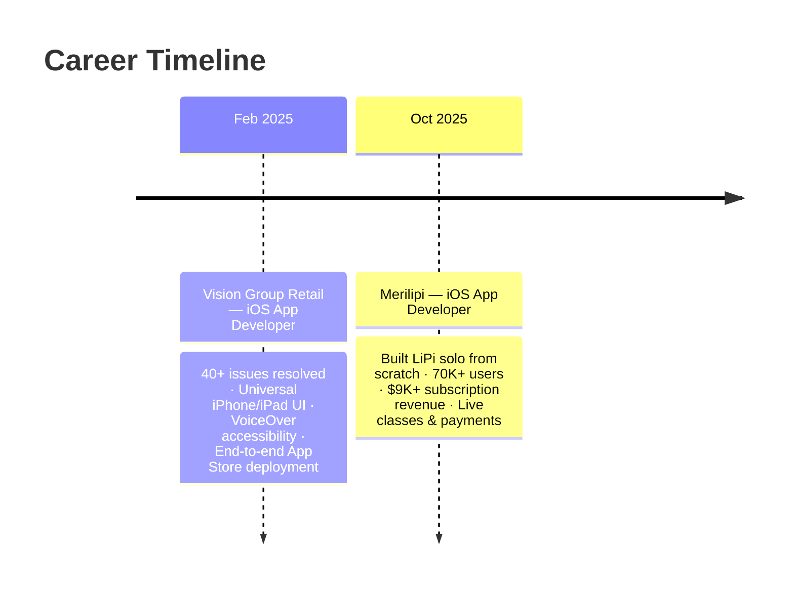

<!-- HERO BANNER -->
<div align="center">


<br/>

[](https://www.linkedin.com/in/nimish-khandelwal-955557265)
[](mailto:nimishkhandelwal2503@gmail.com)
[](https://apps.apple.com/in/app/lipi-punjabi-kids-learning/id6756845236)


</div>

---

## 👨‍💻 About Me

```swift
struct NimishKhandelwal: iOSDeveloper {
    let experience     = "1.5+ years shipping production iOS apps"
    let currentRole    = "iOS App Developer @ Merilipi"
    let flagship       = "LiPi — 70,000+ users in 2 months, 99.5% crash-free"
    let focus          = ["SwiftUI", "Clean Architecture", "Swift Concurrency"]
    let passion        = "Turning ideas into polished App Store products"
    let openTo         = .iOSDeveloperRoles
}
```

- 📲 Sole iOS developer of **[LiPi: Punjabi Kids Learning](https://apps.apple.com/in/app/lipi-punjabi-kids-learning/id6756845236)** — live on the App Store
- 💰 Built subscription flows driving **$9,000+ revenue** (StoreKit + Stripe)
- 📊 Instrumented **400K+ analytics events in 28 days** with Firebase Analytics
- 🎓 B.Tech Computer Science & Engineering — JECRC University, Jaipur

## 🛠 Tech Stack

<div align="center">


</div>

| Category | Technologies |
|----------|-------------|
| **Languages** |     |
| **UI Frameworks** |    |
| **Data & Persistence** |   |
| **Payments & Monetization** |   |
| **Real-time & Media** |     |
| **Backend & Cloud** |   |
| **DevOps & Delivery** |    |
| **Tools** |      |
| **Architecture** | MVVM · MVC · Clean Architecture · Swift Concurrency (async/await) · Modular Design |

## ⭐ Expertise

```text
⭐⭐⭐⭐⭐  Swift
⭐⭐⭐⭐⭐  SwiftUI
⭐⭐⭐⭐⭐  UIKit
⭐⭐⭐⭐⭐  App Store Delivery (Connect · TestFlight · Review)
⭐⭐⭐⭐☆  Clean Architecture / MVVM
⭐⭐⭐⭐☆  Swift Concurrency (async/await)
⭐⭐⭐⭐☆  CoreData / SwiftData
⭐⭐⭐⭐☆  StoreKit / Stripe Payments
⭐⭐⭐⭐☆  Firebase (Auth · Analytics · App Distribution)
⭐⭐⭐☆☆  WebRTC / Agora / LiveKit
```

## 🚀 Featured Projects

<table>
<tr>
<td width="50%" valign="top">

### 📲 LiPi: Punjabi Kids Learning
**Live on the App Store** · 70K+ users · 99.5% crash-free

Kids learning app built **solo, from scratch** — subscriptions, live classes, push notifications, analytics.

**Features:** StoreKit subscriptions · Stripe payments · Agora/LiveKit live classes · Firebase Auth · Push notifications

`SwiftUI` `MVVM` `Clean Architecture` `Swift Concurrency`

[](https://apps.apple.com/in/app/lipi-punjabi-kids-learning/id6756845236)

</td>
<td width="50%" valign="top">

### 💳 AutoPay Tracker
Subscription tracker — every monthly & yearly payment in one place.

**Features:** Payment reminders · Home-screen widget with next bill at a glance

`SwiftUI` `SwiftData` `WidgetKit` `UserNotifications`


</td>
</tr>
<tr>
<td width="50%" valign="top">

### 🧊 Sodexo Perfect Score
Field-operations app for **real-time cooler compliance checks**.

**Features:** Offline-first CoreData persistence · Performance dashboards · iPhone + iPad responsive UI

`Swift` `UIKit` `CoreData`

</td>
<td width="50%" valign="top">

### 🛒 Grocery App
Full-featured grocery shopping experience.

**Features:** Onboarding · Auth · Cart · Wishlist · Order tracking · Profile & payments

`Swift` `UIKit` `CoreData`

[](https://github.com/nimish-khandelwal/Grocery-App)

</td>
</tr>
</table>

## 📊 GitHub Analytics

<div align="center">


</div>

## 💼 Work Experience



<details>
<summary><b>📋 Full Experience Details</b></summary>

### iOS App Developer — Merilipi <sub>Oct 2025 – Present</sub>
- Sole iOS developer for **LiPi: Punjabi Kids Learning**; shipped to App Store, **70,000+ users in 2 months**, **99.5% crash-free sessions**
- Built from scratch: **SwiftUI, MVVM, Clean Architecture, Swift Concurrency**
- Integrated **StoreKit subscriptions, Stripe, Firebase Auth, push notifications, Agora/LiveKit live classes, Meta SDK, Firebase Analytics**
- Tracked **400K+ analytics events in 28 days**; supported **$9,000+ subscription revenue**

### iOS App Developer — Vision Group Retail <sub>Feb 2025 – Sep 2025</sub>
- Resolved **40+ UI, functional, and crash issues**; managed end-to-end App Store deployment
- Universal iPhone/iPad support: **Auto Layout, Size Classes, adaptive UI, VoiceOver accessibility**
- Shipped **4+ new features**; builds via Firebase App Distribution for QA and client review

</details>

## 🎓 Education & Certifications

| | | |
|---|---|---|
| 🎓 | **B.Tech — Computer Science & Engineering** · JECRC University, Jaipur | 2025 · CGPA 8.4/10 |
| 📜 | **iOS & Swift – The Complete iOS App Development Bootcamp** · Udemy | 2025 |


## 🏆 Achievements

- 🚀 **70,000+ users in 2 months** — solo-built app, zero to App Store
- 🛡 **99.5% crash-free sessions** in production
- 💰 **$9,000+ subscription revenue** enabled via StoreKit + Stripe
- 📊 **400K+ analytics events** tracked in 28 days
- 🍎 **Multiple App Store releases** managed end-to-end: submission → review → release

## 💡 Fun Facts

- 📱 My first production app reached more users in 2 months than most apps do in a year
- 🌏 Building an app that teaches kids **Punjabi** — code meets culture
- ⚡ From "Hello World" in a Udemy bootcamp to sole App Store developer in under a year

## ✨ Quote

<div align="center">


</div>

## 🔗 Connect With Me

<div align="center">

[](https://www.linkedin.com/in/nimish-khandelwal-955557265)
[](mailto:nimishkhandelwal2503@gmail.com)
[](tel:+916350038289)
[](https://apps.apple.com/in/app/lipi-punjabi-kids-learning/id6756845236)

<br/>

**💬 Open to iOS Developer opportunities — let's build something great together.**


</div>
